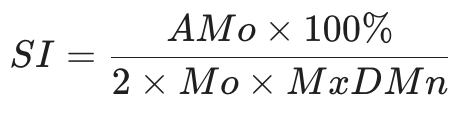

# Drift

**Drift** is a health intelligence tool built for stillness and self-regulation. 
As part of the **[ilseon](https://github.com/cladam/ilseon)** ecosystem, Drift translates the body’s quiet signals into a visual language that remains intuitive even during periods of high cognitive load.

## The Core Problem

Traditional health applications often overwhelm the user with dense charts, persistent notifications, and demands for manual data entry. For neurodivergent users or those managing anxiety, this frequently leads to "data overwhelm", causing them to abandon the tool entirely.

**Drift** addresses this by filtering out the noise. Instead of forcing you to interpret complex data, it provides an **Energy Orb**—a living representation of your current capacity, derived from both biometrics and subjective well-being.

## Key Features

* **Energy Orb:** The central feature of the dashboard. A visual indicator that shifts in colour and pulse based on your recovery. It communicates your "status" without requiring you to read a single number.
* **Readiness Score:** A dedicated card providing an "Executive Summary" number. It combines your morning Heart Rate Variability (HRV) and Stress Index (SI) for a clear, at-a-glance measure of your daily capacity.
* **Trend Sparklines:** Scannable sparkline charts for HRV, Stress Index, and Heart Rate (BPM). These cards show your 7-day trend and highlight the deviation from your average, making it easy to spot changes in your physiological state.
* **Balance Quadrant:** A quadrant-based visualization plotting your current Stress Index against Heart Rate Variability (HRV). It helps you understand the interplay between your body's stress and resilience, showing whether you are in a state of 'High Stress, Low Resilience' or 'Low Stress, High Resilience'.
* **Stress Index (Kubios/Baevsky):** Measures physiological stress via the camera (PPG). By analysing Heart Rate Variability (HRV), Drift provides objective confirmation of whether your nervous system is at rest or on high alert.
* **Vibe Strip (7-Day Trend):** A minimalist weekly view using colour-coded segments to display your historical capacity at a glance.
* **Peak & Valley:** A unique visualisation that contrasts your daily average mood (background) against your absolute current state (border indicator).
* **Contextual Cards:** Intelligent interfaces that only request input when data is missing. If no sleep data is found, the app gently invites you to log it manually rather than displaying an empty graph.

## Design Principles

* **Biological Mirroring:** The app’s movement and rhythm (such as the heartbeat pulse in the orb) are designed to feel organic rather than mechanical.
* **Low Sensory Load:** Utilises the "Quiet Colours" palette from the ilseon ecosystem (Sage, Slate, Ochre, Terracotta) to reduce visual stress.
* **Compassionate Feedback:** Data is never presented as "good" or "bad", but simply as information regarding your current capacity.
* **Glanceability:** The interface is designed so that you can understand your state in under a second.

## Technical Stack

* **UI Toolkit:** Jetpack Compose (utilised for the procedural animations of the Energy Orb).
* **Language:** Kotlin.
* **Architecture:** MVI (Model-View-Intent) for predictable state management.
* **Biometrics:** CameraX ImageAnalysis (for real-time pulse detection via PPG).
* **Database:** Room (for secure, local storage of logs).

## Vision

Drift acts as the bridge between your internal state and your external productivity. 
By understanding your energy levels in Drift, you can make more informed decisions in **[ilseon](https://github.com/cladam/ilseon)** and **[myeon](https://github.com/cladam/myeon)** regarding which tasks you truly have the capacity to tackle.

### Getting started

1. Clone this repository.
2. Open the project in Android Studio
3. Run the project on an emulator or physical device.

### Technical Deep Dive: The Science of Stress Index

**Drift** uses **Photoplethysmography (PPG)** to detect blood volume changes via the smartphone's camera. The resulting heart rate variability (HRV) is processed using a refined version of **Baevsky’s Stress Index**, a methodology originally developed for space medicine to monitor the autonomic nervous system of cosmonauts.

#### The Calculation

Unlike simple Heart Rate (BPM), the Stress Index (SI) analyses the distribution and regularity of **RR intervals** (the time between heartbeats).

* **Mode ():** The most frequent RR interval, representing the dominant heart rhythm.
* **Amplitude of Mode ():** The percentage of intervals that fall into the Mode, indicating the "rigidity" of the rhythm.
* **Variation ():** The difference between the maximum and minimum RR intervals, representing overall variability.

#### The Kubios Refinement

To ensure the data is intuitive for everyday use, **Drift** applies the **Kubios transformation**. The raw Baevsky Index can produce large, non-linear values (e.g., 50–1000+). By taking the **square root** of this number, we align our metrics with clinical standards where a score of **7–12** is considered a healthy, balanced state.

#### Interpreting the States

* **7.0 – 12.0 (Sage):** Optimal regulation. High parasympathetic activity.
* **12.0 – 15.0 (Ochre):** Increased regulatory strain. System is mobilising resources.
* **15.0+ (Terracotta):** High stress. The sympathetic nervous system is dominant, suggesting a need for recovery or grounding.

### Contributing

Contributions are welcome! Please feel free to open an issue or submit a pull request.

Built with ❤️ for the neurodivergent community.
